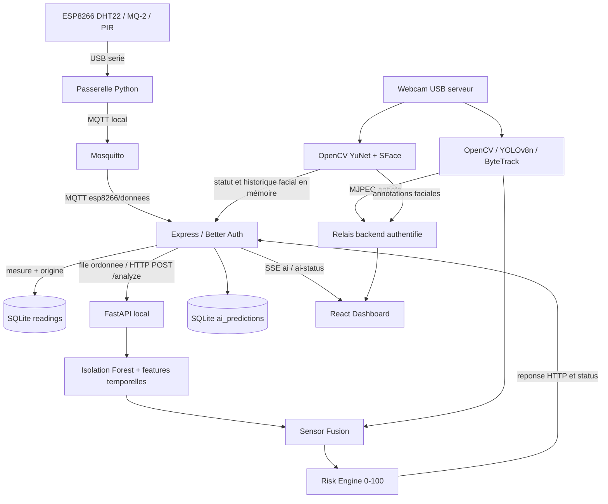

# Sentinel-X : service IA local

Le backend existant reste le point d'entree des capteurs et du dashboard.
L'IA analyse ses mesures via HTTP local. Express conserve les resultats dans
SQLite et les diffuse via **SSE**, le transport deja present dans le projet.
La webcam est celle du PC serveur, jamais celle du navigateur.

Les blocs PowerShell qui commencent par `Set-Location` supposent un nouveau
terminal ouvert a la racine du depot. Aucun modele Isolation Forest entraine
sur des capteurs reels n'est fourni : suivre la section d'entrainement ci-dessous.



## Installation Windows

Prerequis : **Node.js >= 22.13** (24 conseille), **Python 3.12 x64**, Mosquitto
pour les capteurs ou le simulateur. Telecharger Mosquitto depuis
[son site officiel](https://mosquitto.org/download/), s'il n'est pas installe.

Depuis la racine, PowerShell :

```powershell
powershell.exe -NoProfile -ExecutionPolicy Bypass -File .\scripts\setup-windows.ps1
```

Ce script lance `npm ci` dans les deux projets, cree `ai/.venv`, installe les
requirements et cree les `.env` absents. Le secret Better Auth est genere
localement sans affichage. Les fichiers existants sont conserves. Aucun
service ou simulateur ne demarre automatiquement.

Installation Python manuelle equivalente :

```powershell
Set-Location .\ai
py -3.12 -m venv .venv
.\.venv\Scripts\python.exe -m pip install --upgrade pip
.\.venv\Scripts\python.exe -m pip install -r requirements.txt
Copy-Item .env.example .env
```

L'activation est facultative. Si souhaitee :

```powershell
.\.venv\Scripts\Activate.ps1
```

Sans webcam, installer `requirements-core.txt` ou utiliser
`setup-windows.ps1 -CoreOnly`. La vision importe ses dependances uniquement
lors du demarrage de la camera. `requirements-test.txt` ajoute pytest.
`requirements-lock.txt` epingle les dependances de vision et de test pour
reproduire l'environnement Python.

## Lancement du projet complet

Executer d'abord le script d'installation. Ouvrir trois terminaux PowerShell.

**Terminal backend** :

```powershell
Set-Location .\iot-backend
# Premiere fois seulement : creer le compte (mot de passe demande, 12 caracteres minimum).
npm run user:create -- operateur@sentinel.test "Operateur"
node --env-file=.env --import tsx src/main.ts
```

**Terminal frontend** :

```powershell
Set-Location .\iot-frontend
npm run dev -- --host 127.0.0.1
```

**Terminal IA** :

```powershell
Set-Location .\ai
.\.venv\Scripts\python.exe -m app.main
```

Dashboard : http://127.0.0.1:5173 ; backend : http://127.0.0.1:3001 ; IA :
http://127.0.0.1:8001. Se connecter au dashboard avec le compte cree. Sans
modele, l'IA est ONLINE mais l'analyse environnementale indique "modele non
entraine". Sans broker, le dashboard indique MQTT deconnecte. Les commandes
LED, capteurs, comptes et notifications existants conservent leur fonctionnement.

Le firmware actuel transmet les mesures par USB. Dans un quatrieme terminal,
utiliser le broker strictement local fourni s'il n'est pas deja demarre :

```powershell
& 'C:\Program Files\mosquitto\mosquitto.exe' -c .\scripts\mosquitto-local.conf -v
```

Si le broker est deja lance sur le port 1883, conserver cette instance. Dans
un cinquieme terminal, depuis la racine, demarrer la passerelle USB :

```powershell
.\ai\.venv\Scripts\python.exe -m pip install -r .\scripts\requirements-esp.txt
.\ai\.venv\Scripts\python.exe .\scripts\esp_serial_bridge.py
```

Fermer le moniteur serie avant de lancer la passerelle. Voir
[le guide USB](../docs/esp-serial.md) pour retrouver le port et tester les donnees.
Ctrl+C arrete chaque service dans son terminal.

Le lancement `python -m app.main` réserve le port avant de charger les modèles.
Si Sentinel-X est déjà actif sur ce port, la commande affiche
« Sentinel-X IA est déjà démarré » et quitte normalement : utiliser l'instance
existante depuis le dashboard. Elle ne lance ni une seconde webcam ni un
second catalogue facial. Si un autre service occupe le port, elle affiche
une erreur explicite et conserve ce service.
Pour charger un changement de code serveur, arrêter l'instance existante
puis relancer ; cette commande ne remplace pas automatiquement un serveur actif.

## Entrainement sur mesures reelles

`data/sensor_data.example.csv` fournit uniquement l'en-tete du format CSV.
`data/sensor_data.csv` est genere par l'export local et ignore par Git ; vos
mesures ne sont pas publiees avec le depot.
Collecter un historique normal representatif (au moins 128 valeurs observees
pour chacun des quatre champs, idealement plusieurs milliers et plusieurs
conditions normales). Choisir les periodes normales avant l'entrainement.

```powershell
Set-Location .\ai
.\.venv\Scripts\python.exe -m app.integrations.backend_client --database ..\iot-backend\data\telemetry.db --output data\sensor_data.csv
# Relire/filtrer le CSV pour conserver les conditions normales.
.\.venv\Scripts\python.exe -m app.anomaly.trainer
```

L'export lit SQLite sans l'ecrire et exclut les lignes `source=simulation`.
Les lignes anterieures a la migration n'ont pas d'origine connue : elles sont
exclues par defaut. Ajouter `--include-legacy` uniquement si leur origine
reelle et leur normalite sont connues.

Format CSV :

```csv
timestamp,temperature,humidity,gas,presence
2026-10-06T16:00:00+00:00,23.1,51,140,0
```

Les champs numeriques manquants sont imputes avec les medianes apprises.
Les timestamps sont tries chronologiquement. Sans timestamp, une cadence
de deux secondes est supposee. Le modele est sauvegarde atomiquement dans
`models/isolation_forest.joblib`, puis charge au demarrage. Redemarrer l'IA
apres entrainement, ou appeler `/model/reload` avec le token si configure.
Un artefact incompatible avec la version scikit-learn est refuse : reentrainer.

Features : temperature, humidite, gaz, PIR, deltas temperature/gaz, moyennes
et ecarts-types glissants (12 mesures), vitesses de variation, produit
temperature x gaz. Le meme extracteur sert a l'entrainement et a l'inference.
Les sequences sont remises a zero apres une coupure ou un changement d'origine.

`is_anomaly` vient de la frontiere apprise de l'Isolation Forest.
`anomaly_score` normalise la distance a cette frontiere dans [0,1] ; **ce n'est
pas une probabilite**. `confidence` exprime la marge et la disponibilite des
donnees, et diminue si des champs sont manquants. Les principaux ecarts des
features expliquent le resultat sans pretendre expliquer causalement le modele.

## Qualite des mesures et separation des simulations

Les canaux hors limites (-40..80 C, humidite 0..100 %, gaz ADC 0..1023)
sont ignores individuellement avec une raison explicite ; les autres canaux
restent analysables. NaN, infinis et presence autre que booleen/0/1 sont refuses.
Ces limites ne prouvent pas la justesse physique d'une lecture : 76.8 C / 6.9 %
reste transmis tel quel et exige une verification du capteur, pas une conversion.

Les mesures perimees, anterieures a la derniere mesure de leur origine ou
datees de plus de cinq secondes dans le futur ne remplacent pas l'etat courant
ni la fenetre temporelle. Les observations distinctes avec IDs croissants
peuvent partager un timestamp arrondi ; aucun intervalle fictif n'est ajoute.

Live et simulation utilisent des fenetres temporelles distinctes et le meme
modele charge. Les donnees simulees ne sont jamais fusionnees avec la webcam
reelle. Les analyses reelles recentes restent prioritaires pendant trente
secondes, avec conservation des simulations dans l'historique et le SSE.

L'export SQLite omet les canaux explicitement invalides ou en chauffe/calibration
selon les flags du firmware. Les anciens historiques sans flags restent lisibles ;
leur normalite doit etre confirmee manuellement. Les lignes CSV hors plage sont
refusees a l'entrainement, sans correction automatique. Aucun modele reel n'est
entraine automatiquement sur les mesures courantes.

Voir [validation capteurs et IA](../docs/VALIDATION_CAPTEURS_IA.md) pour les
commandes de demarrage, les controles DHT et la procedure de test complete.

## Demonstration sans ESP8266

Mode explicite, dans un terminal dedie. Arreter tout autre simulateur pour
ne pas melanger les scenarios. `run.sh` lance l'ancien simulateur complet et
sa camera fictive : ne pas l'utiliser pour cette demonstration de webcam reelle.

Creer et entrainer un **modele de demonstration distinct** :

```powershell
Set-Location .\ai
.\.venv\Scripts\python.exe -m app.simulator --generate-training data\simulated_normal.csv
.\.venv\Scripts\python.exe -m app.anomaly.trainer --csv data\simulated_normal.csv --output models\demo_isolation_forest.joblib
$env:ANOMALY_MODEL = 'models/demo_isolation_forest.joblib'
.\.venv\Scripts\python.exe -m app.main
```

Avec backend, frontend et broker lances, dans un autre terminal :

```powershell
Set-Location .\ai
.\.venv\Scripts\python.exe -m app.simulator
```

Le simulateur publie 25 mesures normales puis 40 mesures de derive progressive
sur **le topic MQTT reel**. La route complete passe donc par le backend. Les
mesures et analyses portent `source=simulation`, et le dashboard l'affiche.
Il ne publie aucun faux resultat YOLO. La derive reste sous 30 degres et 300
unites de gaz ; les tests verifient qu'une anomalie ML apparait avant ces
seuils illustratifs. Ce resultat de demo ne garantit pas la performance sur
des capteurs reels : entrainer et evaluer sur leurs donnees.

Pour reprendre le modele reel dans ce terminal : arreter l'IA, puis
`Remove-Item Env:ANOMALY_MODEL` et relancer `python -m app.main` avec le Python
du virtualenv. Le CSV synthetique n'est jamais genere ni entraine automatiquement.

## Webcam et YOLO

Installer les dependances de vision et telecharger explicitement les poids
avant la demonstration (Internet necessaire une fois) :

```powershell
Set-Location .\ai
.\.venv\Scripts\python.exe -m pip install -r requirements-vision.txt
Invoke-WebRequest -Uri 'https://github.com/ultralytics/assets/releases/download/v8.3.0/yolov8n.pt' -OutFile .\models\yolov8n.pt
```

Cliquer **Demarrer la webcam** dans le dashboard ou sur la page Camera.
`VISION_CAMERA_INDEX=0` ouvre d'abord la webcam d'index 0 avec DirectShow
sous Windows, puis avec le backend OpenCV par defaut si necessaire.
`CAMERA_INDEX` reste compatible ; `VISION_CAMERA_INDEX` est prioritaire.
Le service emet `starting`, puis `running` uniquement apres la premiere image
JPEG disponible, ou un etat explicite `unavailable/error`.
`VISION_AUTO_START=false` conserve le demarrage manuel par le bouton.

Le navigateur attend cet etat avant d'ouvrir le flux Express. Arreter masque
immediatement la video et libere la webcam. Reessayer reprend le controle de
demarrage et ouvre une nouvelle connexion. La capture et YOLO ont des threads
distincts : un modele absent, lent ou en erreur laisse la video brute disponible,
avec `detection_status` et `detection_error` explicites. La fusion ignore cette
modalite tant que les predictions de personnes ne sont pas disponibles et fraiches.

Frames 640x480, capture limitee a 15 FPS, YOLO sur une frame sur trois,
personnes seulement (`classes=[0]`), confirmation sur trois analyses
consecutives. ByteTrack utilise les IDs si disponible ; un echec du tracker
conserve la detection. Voir la [documentation officielle Ultralytics](https://docs.ultralytics.com/modes/track/).

Les rectangles sont dessines sur le serveur. Un seul JPEG recent est conserve
et partage entre les viewers ; les metadonnees passent separement par SSE.
Le MJPEG compresse passe par `/api/camera/stream` avec la session existante,
jamais par un flux de frames brutes dans les evenements SSE. Plusieurs viewers
ne lancent pas plusieurs inferences. Aucune image n'est enregistree sur disque.
L'ancienne reconnaissance faciale MQTT demeure disponible ; YOLO ne pretend
pas reconnaitre les visages.

## Face Recognition

Le module local indépendant `app/vision/face_recognition.py` utilise OpenCV
YuNet pour les visages et SFace pour leurs embeddings, sans remplacer YOLO ni
ByteTrack. Il utilise les dépendances OpenCV/NumPy déjà installées. Pillow,
déjà présent via YOLO, est explicite dans `requirements-vision.txt` pour vérifier
les photos, corriger leur orientation et supprimer leurs métadonnées EXIF.

```powershell
Set-Location .\ai
.\.venv\Scripts\python.exe -m pip install -r requirements-vision.txt
.\.venv\Scripts\python.exe -m app.vision.setup_faces
```

Dans **Caméra → Reconnaissance faciale → Ajouter une personne**, saisir un nom,
sélectionner **1 à 5 photos**, puis cliquer **Enregistrer la personne**. Préférer
3 à 5 photos nettes de la même personne, avec un seul visage par photo.
JPEG/PNG/WebP sont acceptés : **5 Mio maximum par photo, 15 Mio par envoi,
4096 pixels par côté et 16 mégapixels**. Le modèle facial doit être disponible ;
la webcam peut rester arrêtée.

Le navigateur envoie le JSON à `POST /api/ai/vision/faces/enroll` avec sa session ;
Express relaie vers `POST /vision/faces/enroll` avec le token serveur éventuel.
Les références sont enregistrées sous `FACE_KNOWN_DIR/Nom/` en JPEG nommés par UUID,
sans écraser les anciennes photos, puis le catalogue est rechargé automatiquement.
Réutiliser un nom existant ajoute des photos à cette identité. Chaque photo
illisible, sans visage, trop petite ou avec plusieurs visages reçoit un motif
de refus. Un envoi peut réussir partiellement ; les fichiers refusés restent
sélectionnés pour correction. Si toutes les photos sont refusées, aucune
référence n'est ajoutée.

L'ajout manuel reste possible dans `ai/known_faces/Mohamed/photo1.jpg`,
`photo2.jpg`, `photo3.jpg`. Chaque dossier porte le nom affiché. Le dossier
est scanné au démarrage ; après ajout manuel, suppression ou remplacement,
**Recharger les visages connus** recharge les photos sans redémarrer Python.
Sans identité connue, les visages restent `Unknown` / `Inconnu`.

```dotenv
FACE_RECOGNITION_ENABLED=true
FACE_RECOGNITION_THRESHOLD=0.55
FACE_RECOGNITION_EVERY_N_FRAMES=3
FACE_RECOGNITION_MAX_FPS=2
FACE_KNOWN_DIR=known_faces
FACE_EVENT_COOLDOWN_SECONDS=5
FACE_MIN_SIZE_PIXELS=40
FACE_DETECTOR_MODEL=models/face_detection_yunet_2023mar.onnx
FACE_EMBEDDING_MODEL=models/face_recognition_sface_2021dec.onnx
```

L'envoi conserve `FACE_KNOWN_DIR` et n'introduit aucune nouvelle variable `.env`.
Relancer Python et Express une fois après mise à jour du code si ces services
exécutent encore l'ancienne version, puis actualiser le dashboard.

Le worker facial ne bloque pas la capture. Les 20 derniers événements restent
en mémoire avec un cooldown de 5 secondes. Les résultats courants sont exposés
dans `vision.faces` du statut IA, puis relayés via Express/SSE. Ils ne sont pas
dupliqués dans les prédictions capteurs/risque persistées en SQLite.
Le score affiché correspond à une similarité, pas à une probabilité d'identité.
Cette fonction de monitoring ne doit pas être l'unique sécurité critique.

API, limites, tests et inventaire complet :
[docs/FACE_RECOGNITION.md](../docs/FACE_RECOGNITION.md).

## API et contrat backend

Le backend s'abonne aux mesures enregistrees, les met en file ordonnee et appelle
`POST /analyze`. Les messages rejoues de plus de 30 secondes restent dans
l'historique, sans devenir une menace courante. La file est bornee a 32 mesures,
les requetes expirent apres cinq secondes, et le status est interroge toutes
les deux secondes. Les nouvelles mesures reprennent automatiquement l'analyse
lors du retour de l'IA. Les echantillons non analyses en panne ne sont pas
reinventes ; le dashboard montre la disponibilite et les pertes en surcharge.

Configuration backend dans `iot-backend/.env` :

```dotenv
AI_SERVICE_URL=http://127.0.0.1:8001
AI_TIMEOUT_MS=5000
AI_POLL_MS=2000
AI_SERVICE_TOKEN=
```

Un `AI_SERVICE_URL` vide desactive l'IA. Un `VISION_STREAM_URL` explicite reste
prioritaire ; sinon le backend relaie `AI_SERVICE_URL/stream.mjpg`. Pour Docker,
definir `AI_SERVICE_URL=http://host.docker.internal:8001` et
`VISION_STREAM_URL=http://host.docker.internal:8001/stream.mjpg` dans le `.env`
de Compose. Sa valeur video vide desactive explicitement la camera.
Autoriser seulement le reseau interne a joindre le service Python du serveur,
avec un token commun (la webcam reste sur l'hote). Le lancement Windows
documente utilise directement la boucle locale.

Python ecoute par defaut sur `127.0.0.1`. Un token optionnel commun
`AI_SERVICE_TOKEN` protege status, predictions, controles et video avec
`Authorization: Bearer ...`. Le backend le transmet ; aucun secret n'est
transmis au frontend. `/health` et `/` restent publics. Ne charger que des
artefacts joblib/YOLO locaux de confiance.

| Python local | Resultat |
| --- | --- |
| `GET /`, `GET /health` | identification et healthcheck |
| `GET /status` | modele, vision et derniere prediction complete |
| `POST /analyze` | anomalie + vision courante + fusion + risque |
| `POST /predict/anomaly` | resultat d'anomalie seul |
| `POST /model/reload` | rechargement du modele local |
| `GET /vision/status` | personnes, boxes, confirmation et performances |
| `POST /vision/start`, `POST /vision/stop` | webcam locale |
| `GET /stream.mjpg` | MJPEG annote |
| `GET /risk/latest` | dernier risque, ou null |

| Backend, session requise | Resultat |
| --- | --- |
| `GET /api/ai/status` | online, modele, vision, file et erreur |
| `GET /api/ai/latest` | prediction persistante avec id, ou null |
| `GET /api/ai/history?limit=50` | `{predictions:[...]}` ; limite 1..500 |
| `POST /api/ai/vision/start`, `POST /api/ai/vision/stop` | relais des controles |
| `GET /api/ai/vision/status` | etat direct de la webcam |
| `GET /api/stream` | SSE existant : `reading`, `vision`, nouveaux `ai`, `ai-status` |
| `GET /api/camera/stream`, `GET /api/ai/vision/stream` | relais video authentifie |

Pas de nouvel endpoint MQTT/telemetrie public ni de deuxieme WebSocket : ces
fonctionnalites existent deja. Les analyses ont la meme retention que les
capteurs (sept jours par defaut).

Exemple d'analyse directe locale, sans token :

```powershell
$sample = @{ temperature=24.8; humidity=52; gas=170; presence=0 } | ConvertTo-Json
Invoke-RestMethod -Method Post -Uri http://127.0.0.1:8001/analyze -ContentType application/json -Body $sample
```

Structure de prediction (les valeurs ci-dessous illustrent le **format**, pas
des donnees inserees dans le projet) :

```json
{
  "sample_id": 42,
  "sensor_timestamp": "2026-10-06T16:00:00Z",
  "anomaly": {
    "status": "ready", "is_anomaly": true, "anomaly_score": 0.82,
    "confidence": 0.64, "reason": "Abnormal temperature/gas evolution (correlated rise)",
    "features": {"temp_delta": 0.12, "gas_delta": 2.5},
    "missing_fields": [], "timestamp": "2026-10-06T16:00:00Z"
  },
  "vision": {
    "status": "running", "error": null,
    "person_detected": true, "person_count": 1, "max_confidence": 0.91,
    "confirmed": true,
    "objects": [{"class": "person", "confidence": 0.91, "bbox": [10,20,100,200], "track_id": 1}],
    "timestamp": "2026-10-06T16:00:00Z", "fps": 14.2,
    "inference_time_ms": 83.2, "last_prediction_time": "2026-10-06T16:00:00Z"
  },
  "risk": {
    "risk_score": 100, "risk_level": "CRITICAL", "category": "MULTI_THREAT",
    "reasons": ["Person detected by camera (confirmed)", "PIR sensor active", "Correlated drift"],
    "confidence": 0.955, "degraded": false, "timestamp": "2026-10-06T16:00:00Z"
  },
  "timestamp": "2026-10-06T16:00:00Z", "source": "live"
}
```

Le backend ajoute `id`. Les inconnues sont `null`, pas de faux zero de prediction.
La fusion ignore la vision de plus de cinq secondes et les capteurs de plus
de trente secondes. `degraded=true` signale les modalites manquantes ; le
dashboard affiche INDETERMINE a la place de SAFE si la couverture est incomplete.

Risk Engine : 0-24 SAFE, 25-49 LOW, 50-74 MEDIUM, 75-89 HIGH, 90-100 CRITICAL.
PIR seul a faible confiance ; vision confirmee seule a confiance intermediaire ;
PIR + vision confirmes a forte confiance. Une anomalie environnementale doit
venir du ML, puis les deltas correles augmentent son poids. Categories SAFE,
INTRUSION, ENVIRONMENT, MULTI_THREAT, SENSOR_ANOMALY. Les poids sont explicites
et demonstratifs, pas une calibration de probabilite ou une certification de securite.

## Tests

Depuis la racine :

```powershell
npm --prefix iot-backend test
npm --prefix iot-backend run typecheck
npm --prefix iot-backend run build
npm --prefix iot-frontend test
npm --prefix iot-frontend run lint
npm --prefix iot-frontend run build
Set-Location ai
.\.venv\Scripts\python.exe -m pip install -r requirements-test.txt
.\.venv\Scripts\python.exe -m pytest -q
Set-Location ..
node .\scripts\check-ai-integration.mjs
node .\scripts\check-face-enrollment.mjs
```

Les tests entrainent leurs propres modeles temporaires sur des donnees
synthetiques pour verifier normal/anomalie et le preprocessing commun. Ils
couvrent aussi donnees manquantes, schemas, risques, fusion,
fraicheur, health, token, absence camera/modele, confirmation multi-frame,
demarrage/arret/reprise, panne et reprise de l'IA, SQLite, protection des routes
et SSE. L'integration lance un Python temporaire et utilise de vrais appels
HTTP, parsing telemetrie, persistance et SSE ; aucun capteur, webcam ou broker
n'est necessaire pour ces tests.

`check-face-enrollment.mjs` utilise le frontend et Express compilés, un FastAPI
temporaire, des photos synthétiques et un backend facial factice. Il vérifie le
formulaire navigateur, la session, l'envoi via Express, les JPEG enregistrés,
le rechargement et le rejet d'une photo sans visage. Installer Edge, Chrome ou
Chromium, ou définir `FACE_TEST_BROWSER` ; `AI_TEST_PYTHON` permet de choisir
un autre interpréteur que `ai/.venv`. Le test n'ouvre pas de webcam, n'utilise
aucune photo connue réelle et ne mesure pas la précision biométrique.

## Depannage Windows

- `Activate.ps1` bloque : utiliser directement `.venv\Scripts\python.exe`, ou
  autoriser l'execution uniquement dans le processus courant si souhaite.
- `npm.ps1` bloque : remplacer `npm` par `npm.cmd`. Le script d'installation
  utilise deja `npm.cmd`.
- `node:sqlite` absent : verifier `node --version`, installer Node >=22.13.
- `py -3.12` absent : `py --list-paths` puis installer Python 3.12 x64.
- Erreur de DLL OpenCV/PyTorch : installer le redistribuable Microsoft Visual
  C++ x64 et verifier que Python, les wheels et Windows sont en 64 bits.
- Webcam indisponible : fermer Teams/Zoom, verifier les autorisations Windows
  pour les applications de bureau, tester `VISION_CAMERA_INDEX=0` puis 1. DirectShow
  est tente en premier, puis le backend OpenCV par defaut.
- Poids YOLO absents : telecharger `models/yolov8n.pt` explicitement. Le service
  ne telecharge pas de modele et n'installe aucune dependance en production.
- Webcam retiree : l'etat devient unavailable ; rebrancher et redemarrer la
  vision depuis le dashboard. Les capteurs continuent d'etre analyses.
- IA OFFLINE : verifier `GET /health`, port 8001, URL backend et token identique.
  Une erreur IA n'interrompt ni MQTT, ni les commandes, ni le dashboard.
- `[Errno 10048]` : une instance est déjà lancée. La commande actuelle détecte
  ce cas avant le démarrage. Vérifier `http://127.0.0.1:8001/health` et utiliser
  le dashboard si Sentinel-X répond. Les instances relancées en arrière-plan
  peuvent continuer à fonctionner même si les anciens terminaux sont fermés.
- Modele non entraine : remplir le CSV normal, entrainer puis redemarrer/recharger.
- Scores frequemment anormaux : collecter une base normale plus representative
  et verifier cadence, calibration MQ-2 et donnees manquantes avant d'ajuster
  `ANOMALY_CONTAMINATION`.
- Flux camera toujours fictif : retirer l'ancien `VISION_STREAM_URL` du backend
  et arreter l'ancien simulateur. La valeur explicite a priorite sur l'IA.

Voir aussi [architecture et compte rendu](../docs/AI_IMPLEMENTATION.md) et
[inventaire des fichiers](../docs/AI_FILES.md), ainsi que la
[correction camera et ses tests physiques](../docs/CAMERA_FIX.md).
