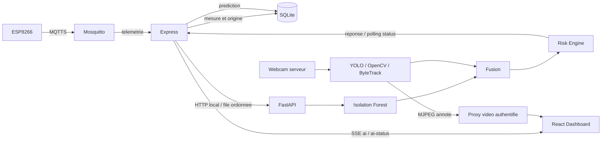

# Integration IA Sentinel-X : livraison

Le dossier `ai/` et son integration backend/frontend sont implementes.
Les mecanismes deja presents restent les points d'entree : MQTT pour l'ESP8266,
SQLite pour les mesures, Better Auth pour le dashboard, SSE pour le temps reel,
et le proxy MJPEG pour la video. Le firmware n'a pas ete modifie.

L'inventaire exhaustif des fichiers crees et modifies est dans
[AI_FILES.md](AI_FILES.md). Les commandes PowerShell, schemas et depannage
sont dans [ai/README.md](../ai/README.md).

## Architecture livree



### Chemin des mesures

1. Le firmware publie sur `esp8266/donnees` via son broker MQTTS.
2. Le gateway MQTT existant valide le JSON. Les champs optionnels, `presence`
   booleen et `ts` epoch restent compatibles ; `presence=0/1` et `timestamp`
   ISO sont aussi acceptes.
3. `RecordTelemetry` stocke la mesure et son origine puis publie l'evenement
   `reading`. Les anciens enregistrements sont conserves avec origine inconnue.
4. `AiCoordinator` analyse les mesures courantes dans l'ordre, via
   `POST /analyze` sur Python. MQTT n'attend pas l'IA.
5. Python reutilise le meme preprocessing que le trainer, execute l'Isolation
   Forest charge, fusionne les capteurs avec la vision recente et calcule le risque.
6. Express valide la reponse, la stocke dans `ai_predictions`, et publie `ai`
   dans le flux SSE deja utilise par le frontend.
7. Une interrogation periodique de `/status` recupere les changements de
   camera meme en l'absence de nouvelles mesures.

### Routes et evenements

Routes backend ajoutees, toutes derriere la session existante :

```text
GET  /api/ai/status
GET  /api/ai/latest
GET  /api/ai/history?limit=50
POST /api/ai/vision/start
POST /api/ai/vision/stop
```

Nouveaux evenements **SSE**, aucun nouveau WebSocket :

- `ai` : prediction persistante, avec son identifiant SQLite ;
- `ai-status` : disponibilite, modele, camera, erreur, file et pertes en surcharge.

Les evenements `reading` et `vision`, ainsi que `/api/camera/stream`, sont
conserves. Le frontend charge l'historique puis recoit le direct ; il recharge
les evenements manques apres une reconnexion et ne remplace pas un etat SSE
recent par une ancienne reponse HTTP.

Routes Python : `/`, `/health`, `/status`, `/analyze`, `/predict/anomaly`,
`/model/reload`, `/vision/status`, `/vision/start`, `/vision/stop`, `/stream.mjpg`,
`/risk/latest`. Le dashboard ne les appelle pas directement.

## Comportements importants

- **Vraie prediction ML** : Isolation Forest, quatre capteurs et neuf features
  derivees. Le risque environnemental commence par une anomalie apprise ; la
  correlation gaz/temperature enrichit l'analyse.
- **Modele absent** : statut untrained, scores inconnus a null. Aucun faux
  modele ni entrainement automatique au demarrage.
- **Donnees incompletes** : medianes apprises, raison explicite et confiance
  reduite ; aucune hausse artificielle fabriquee par l'imputation.
- **Vision** : recherche de webcam locale, 640x480, YOLO personnes seulement,
  analyses espacees et confirmation consecutive avec IDs ByteTrack si disponibles.
- **Performance** : un worker camera et un JPEG recent partage, FPS/temps
  d'inference/derniere detection exposes. La video ne passe pas par SSE.
- **Pannes** : timeout HTTP, file bornee, reprise automatique sur nouvelles
  mesures, status OFFLINE, conservation du dernier resultat. L'application
  existante continue si le modele, la webcam ou Python sont absents.
- **Fraicheur** : un rejeu ancien ne declenche pas un risque actuel ; les
  modalites perimees sont ignorees et le risque devient partiel.
- **Simulation** : origine persistante et libelle dans le dashboard. L'export
  d'entrainement exclut les mesures simulees. Les CSV synthetiques et le modele
  demo sont crees seulement par une commande explicite.
- **Compatibilite** : l'ancien flux vision/facial et les notifications existantes
  restent en place. YOLO ne simule pas une reconnaissance faciale.

Les poids de risque et les confiances sont des indices demonstratifs explicites,
pas des probabilites calibrees. Un modele entraine sur une simulation ne suffit
pas a valider la performance sur du materiel reel.

## Verifications effectuees sous Windows

| Verification | Resultat |
| --- | --- |
| Backend : tests | 39 tests reussis apres correction camera |
| Backend : typecheck et build | reussis |
| Frontend : tests | 15 tests reussis apres correction camera et affichage des detections |
| Frontend : lint et build | reussis |
| Python : suite complete apres correction camera | 42 tests reussis |
| Python : vision apres corrections de cycle de vie | 10 tests reussis, dont 8 deja dans la suite initiale |
| Python : fusion finale | 13 tests reussis, deja dans la suite initiale |
| Python : nouveaux controles d'export | 2 controles reussis directement dans le workspace |
| Integration reelle HTTP Python / Node / SQLite / SSE | reussie |
| `pip check` | aucune dependance incompatible |
| Script PowerShell : configuration sans reinstallation | reussi |

L'integration demarre un serveur Python temporaire protege par un token et un
backend de test avec bases isolees. Elle verifie les mesures partielles au format
firmware, les routes et SSE authentifies, la persistance, le controle vision sans
materiel, la deduplication, une panne Python puis sa reprise. Elle ne substitue
pas un test du transport physique MQTT ou d'une webcam.

Dependances vision effectivement installees et essayees : OpenCV 4.14.0,
Ultralytics 8.4.174, PyTorch 2.14.1 CPU, lap 0.5.13. Les poids officiels YOLOv8n
ont ete telecharges explicitement dans `ai/models/yolov8n.pt` (fichier ignore).
Sur des images noires 640x480, ByteTrack est reste actif et a retourne zero
personne ; inference initiale environ 2,16 secondes, suivantes environ 28-58 ms.
Ces mesures locales ne sont pas une garantie de FPS avec une webcam reelle.

La suite Python complete a ete relancee lors de la correction camera.
L'avertissement Starlette concernant son ancien client httpx de test ne
concerne pas le service en production. Les tests physiques du flux React,
du proxy Express, de FastAPI, des arrets et reprises sont documentes dans
[CAMERA_FIX.md](CAMERA_FIX.md).

## A verifier sur le materiel

- Collecter et selectionner un historique **normal reel**, entrainer le modele,
  puis evaluer les faux positifs et la derive des capteurs.
- Demarrer le broker MQTTS existant et verifier les certificats/reseau de
  l'ESP8266 ; aucun broker n'a ete installe ni reconfigure sur le PC.
- Evaluer les performances et les faux positifs de YOLO sur des sequences
  representatives. Le flux physique 640x480 et les boutons React ont ete
  verifies dans Edge lors de la correction camera.

## Demonstration conseillee

1. Demarrer broker, backend, frontend et IA selon [le README](../ai/README.md).
2. Se connecter ; verifier ONLINE, puis le statut du modele.
3. Pour une demo sans carte, entrainer le modele demo distinct et lancer
   `python -m app.simulator` avec le Python du virtualenv. Montrer le libelle
   SIMULATION et la detection de derive avant les seuils illustratifs.
4. Demarrer la webcam ; montrer boxes, confirmation, performances et fusion PIR.
5. Arreter Python ; montrer OFFLINE et la continuite des capteurs/commandes.
6. Relancer Python ; verifier le retour ONLINE et les nouvelles predictions.
