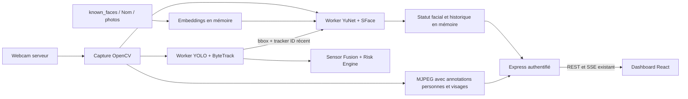

# Face Recognition

Reconnaissance faciale locale avec OpenCV YuNet et SFace.

## Fonctionnement

Trois niveaux séparés : YOLO détecte les personnes, ByteTrack fournit les IDs
de suivi, YuNet/SFace détecte les visages et compare leurs embeddings faciaux.
La reconnaissance analyse l'image complète, même si YOLO est indisponible.
Un visage entièrement contenu dans une bbox de personne reçoit son `tracker_id`
si le suivi YOLO/ByteTrack a moins d'une seconde ; sinon cet ID vaut `null`.



La capture, YOLO et la reconnaissance faciale ont leurs propres workers. Les
modèles faciaux et le rechargement des photos partagent un verrou ; la capture
ne prend pas ce verrou. Une inférence faciale lente ou indisponible ne bloque
donc pas le flux MJPEG ni YOLO. Les anciennes sessions caméra ne peuvent pas
publier des résultats après un arrêt/redémarrage.

Les embeddings sont normalisés puis comparés par similarité cosinus. Pour une
identité possédant plusieurs photos, le meilleur score est utilisé. Un score
au-dessus du seuil produit `known=true` et le nom du dossier ; sinon le nom API
est `Unknown`, affiché **Inconnu**. `confidence=max(0, similarity)` ; la similarité
signée originale est aussi disponible. Sans référence, la similarité vaut
`null` et la confiance API vaut 0 : l'interface indique « Non évaluée ».

Les 20 derniers événements sont gardés en mémoire, du plus récent au plus ancien.
Le cooldown est appliqué par identité connue et par suivi/face ID pour les
inconnus. Un bref passage sans visage conserve les IDs faciaux pendant 2 secondes.
L'arrêt efface les résultats courants mais garde l'historique. Le rechargement
remplace atomiquement le catalogue et garde l'historique ; un échec global de
rechargement conserve le dernier catalogue valide. Un redémarrage Python vide
l'historique. Les métadonnées faciales ne sont pas dupliquées dans les prédictions
capteurs/risque stockées en SQLite.

Les noms/embeddings ne participent pas au Risk Engine. Cette fonctionnalité
sert à la démonstration et au monitoring, jamais comme unique mécanisme de
sécurité critique. Le score est une similarité, pas une probabilité d'identité ;
90–95 % n'est pas garanti et le seuil doit être évalué sur vos propres images.

## Modèles et dépendances

OpenCV/NumPy sont déjà présents dans les requirements. Pillow, déjà installé
avec YOLO, est désormais explicite dans `requirements-vision.txt` pour décoder,
valider et normaliser les photos envoyées. Aucun dlib, InsightFace,
ONNX Runtime ou framework Python supplémentaire n'est nécessaire. Le choix
s'appuie sur les [API officielles OpenCV YuNet/SFace](https://docs.opencv.org/4.13.0/d0/dd4/tutorial_dnn_face.html).
Les poids épinglés compatibles OpenCV 4.x proviennent du
[dépôt officiel OpenCV Zoo](https://github.com/opencv/opencv_zoo).

| Modèle | Taille | SHA-256 |
| --- | --- | --- |
| `face_detection_yunet_2023mar.onnx` | 232 589 octets | `8f2383e4dd3cfbb4553ea8718107fc0423210dc964f9f4280604804ed2552fa4` |
| `face_recognition_sface_2021dec.onnx` | 38 696 353 octets | `0ba9fbfa01b5270c96627c4ef784da859931e02f04419c829e83484087c34e79` |

Installation explicite, une fois, avec Internet ; ouvrir un terminal à la racine :

```powershell
Set-Location .\ai
# Installer ou mettre à jour les dépendances vision, dont Pillow :
.\.venv\Scripts\python.exe -m pip install -r requirements-vision.txt
.\.venv\Scripts\python.exe -m app.vision.setup_faces
```

Les modèles sont téléchargés localement et ignorés par Git. Le script
conserve un modèle dont l'empreinte est correcte et remplace atomiquement un
fichier différent après vérification. Il télécharge aussi les licences MIT
(YuNet) et Apache 2.0 (SFace). Aucun téléchargement automatique au démarrage
du service ou pendant la webcam. Une fois installés, modèles et photos sont
traités localement hors ligne.

## Photos

### Ajouter depuis le dashboard

1. Se connecter au dashboard, puis ouvrir **Caméra → Reconnaissance faciale**.
2. Dans **Ajouter une personne**, saisir le nom à afficher, par exemple `Mohamed`.
3. Sélectionner **1 à 5 photos** de cette personne. Les aperçus sont locaux au
   navigateur ; retirer un fichier permet de corriger la sélection.
4. Cliquer **Enregistrer la personne** et attendre le bilan. Le catalogue et ses
   compteurs sont actualisés automatiquement, sans cliquer sur le bouton de
   rechargement ni redémarrer Python.

La webcam peut être arrêtée pendant l'ajout. Le module facial doit être activé
et ses modèles installés et chargés ; sinon l'interface indique leur indisponibilité.
Réutiliser le nom d'une identité existante ajoute des références à son dossier,
en reconnaissant les variantes de casse, sans écraser les photos déjà présentes.

| Critère | Limite |
| --- | --- |
| Formats d'envoi | JPEG/JPG, PNG ou WebP, image fixe |
| Nombre par envoi | 1 à 5 photos |
| Taille de chaque fichier | 5 Mio maximum |
| Taille totale des fichiers | 15 Mio maximum |
| Résolution d'entrée | 4096 pixels maximum par côté et 16 mégapixels |
| Contenu | un seul visage net, assez grand pour `FACE_MIN_SIZE_PIXELS` |

Préférer **3 à 5 photos par personne**, de face et sous des angles/éclairages
légèrement différents. Le nom est normalisé en Unicode NFC, limité à 64 caractères
et doit contenir au moins une lettre ou un chiffre. Les lettres, nombres, espaces,
`_`, `-` et l'apostrophe `'` sont acceptés ; points, séparateurs de chemin, noms
Windows réservés (`CON`, `COM1`, etc.), `Unknown` et `Inconnu` sont refusés.

Python vérifie le contenu réel, corrige l'orientation EXIF, réduit les grandes
photos à 1600 pixels maximum par côté et supprime les métadonnées EXIF, dont la
localisation éventuelle. Les références sont sauvegardées en **JPEG nommés par
UUID** sous `FACE_KNOWN_DIR/Nom/`, puis chargées en mémoire. Les noms des fichiers
envoyés servent seulement à afficher le bilan, jamais à choisir un chemin local.

Une photo illisible, sans visage, trop éloignée ou contenant plusieurs visages
reçoit un motif de refus. Les autres photos du même envoi peuvent être ajoutées.
Le bilan indique le nombre accepté et chaque fichier à corriger ; les refus
restent sélectionnés. Si toutes les photos sont refusées, aucune référence n'est
ajoutée et l'identité n'est pas créée. Un échec d'enregistrement ou de chargement
des nouvelles références retire les fichiers de cet envoi et conserve les anciens.

### Ajout manuel

L'ajout par fichier reste possible. Créer un sous-dossier par personne, par exemple
`ai/known_faces/Mohamed/` :

```text
ai/
  known_faces/
    Mohamed/
      photo1.jpg
      photo2.jpg
      photo3.jpg
    Personne2/
      photo1.jpg
      photo2.jpg
```

Recommandation : 3 à 5 photos récentes et nettes par personne, de face et avec
de légers angles/éclairages différents, sans autre visage. Privilégier JPG, JPEG,
PNG et WebP. Les chemins Windows avec accents sont supportés via
`imdecode`/`fromfile`. Les noms réservés `Unknown` et `Inconnu` sont ignorés.
Les sous-dossiers cachés/liens symboliques ne sont pas scannés.

Les images sans visage, avec plusieurs visages, illisibles ou avec un visage
plus petit que `FACE_MIN_SIZE_PIXELS` sont ignorées avec un log `[FACE]`.
Le compteur de références correspond aux images effectivement chargées.
Sans photo exploitable, le catalogue contient 0 identité et la détection
faciale fonctionne toujours. Aucun exemple n'est inscrit en production.

Après ajout manuel, suppression ou remplacement :
**Caméra → Recharger les visages connus**. L'ajout par formulaire recharge déjà
le catalogue automatiquement. Les logs
affichent notamment `Loading known faces`, `Loaded Mohamed: 3 reference images`,
`Recognized Mohamed similarity=...`, `Unknown face detected` et
`No face detected in file ...`. Le nom du dossier est le nom affiché.

Les photos de référence par défaut et les modèles ONNX sont ignorés par Git.
Ni images webcam ni embeddings ne sont transmis au navigateur. Aucune capture
webcam n'est sauvegardée et aucun avatar n'est ajouté : le projet ne fournissait
pas de capture faciale exploitable pour cet affichage.

## Configuration

Configurer ces variables dans votre fichier local `ai/.env` ; leurs valeurs
par défaut sont documentées dans `ai/.env.example` :

```dotenv
FACE_RECOGNITION_ENABLED=true
FACE_RECOGNITION_THRESHOLD=0.55
FACE_RECOGNITION_EVERY_N_FRAMES=3
FACE_RECOGNITION_MAX_FPS=2
FACE_KNOWN_DIR=known_faces
FACE_EVENT_COOLDOWN_SECONDS=5
FACE_MIN_SIZE_PIXELS=40
FACE_DETECTOR_MODEL=models/face_detection_yunet_2023mar.onnx
FACE_EMBEDDING_MODEL=models/face_recognition_sface_2021dec.onnx
```

Les chemins relatifs sont résolus depuis `ai/`, quel que soit le dossier de
lancement. La reconnaissance utilise au moins 3 frames d'écart et au maximum
2 analyses/seconde avec les valeurs ci-dessus. Les changements de `.env`
demandent un redémarrage Python ; le rechargement des photos n'en demande pas.
Le formulaire conserve `FACE_KNOWN_DIR` et n'ajoute aucune variable `.env`.
Le seuil configure la comparaison d'identité ; la confiance de détection du
visage est indépendante et fournie comme `detection_confidence`.

Conserver les variables existantes : `AI_PORT=8001` côté Python et
`AI_SERVICE_URL=http://127.0.0.1:8001` côté Express. Si `AI_SERVICE_TOKEN` est
configuré, il doit être identique dans les deux services et reste côté serveur.
Le navigateur utilise uniquement Express avec la session existante.

Le lancement Python réserve le port avant de construire l'application. Si une
instance Sentinel-X saine répond déjà sur ce port, il affiche « Sentinel-X IA
est déjà démarré » puis quitte avec le code 0, sans erreur 10048, second chargement
de modèles ni second accès webcam. Un port occupé par un autre service provoque
un message explicite et un code 1 ; aucun processus n'est arrêté automatiquement.
Le socket réservé est transmis à Uvicorn pour éviter une course entre vérification
du port et démarrage. Le premier lancement et les doubles lancements ont été testés.

## API

| Express, session requise | FastAPI, token si configuré | Réponse |
| --- | --- | --- |
| `GET /api/ai/vision/faces/status` | `GET /vision/faces/status` | état, compteurs, catalogue, résultats courants et historique |
| `GET /api/ai/vision/faces/latest` | `GET /vision/faces/latest` | `{ faces, timestamp, status }` |
| `GET /api/ai/vision/faces/history` | `GET /vision/faces/history` | `{ faces }`, jusqu'à 20 événements |
| `POST /api/ai/vision/faces/reload` | `POST /vision/faces/reload` | statut complet après rechargement |
| `POST /api/ai/vision/faces/enroll` | `POST /vision/faces/enroll` | `{ name, added, rejected, catalog }` après ajout et rechargement |

Le statut complet figure aussi dans `vision.faces` de `/api/ai/status` et
`/api/ai/vision/status`, puis dans les événements SSE `ai-status`. Aucun nouveau
flux SSE ni boucle de polling frontend n'est nécessaire. Express vérifie le
contrat JSON. Le rechargement et l'ajout disposent d'un délai réseau de 60 secondes, séparé
du délai de 5 secondes des autres appels IA.

Le navigateur appelle uniquement Express avec sa session. Express transmet le
token du service IA côté serveur ; aucun accès direct à FastAPI n'est nécessaire.
Le corps d'ajout est un JSON de cette forme, avec le vrai contenu base64 à la
place de l'indication ci-dessous :

```json
{
  "name": "Mohamed",
  "images": [
    { "filename": "photo1.jpg", "content_base64": "BASE64_CANONIQUE_DU_FICHIER" }
  ]
}
```

Le base64 doit être canonique, avec son remplissage `=` si nécessaire, sans
préfixe `data:` ni espaces. La limite HTTP est de 21 Mio de JSON, après
authentification, uniquement pour cette route. Les autres routes JSON Express
gardent leur limite de 16 Kio. Une réponse HTTP 200 peut contenir `added: 0` et
des refus ; `catalog` contient le statut facial complet. Les erreurs globales
renvoient `{ "message": "..." }` via Express : 400/422 pour les données invalides,
413 pour une taille excessive et 503 pour un modèle/service ou stockage
indisponible. Une session absente renvoie 401 avant de traiter les photos.

Exemple de visage reconnu :

```json
{
  "face_id": "UUID",
  "name": "Mohamed",
  "known": true,
  "confidence": 0.91,
  "similarity": 0.91,
  "detection_confidence": 0.99,
  "recognizable": true,
  "reason": null,
  "bbox": [100, 60, 180, 160],
  "timestamp": "2026-10-06T17:45:12+00:00",
  "tracker_id": 7
}
```

Les bbox sont au format `[x1, y1, x2, y2]`, dans l'image caméra 640×480. Le
`face_id` sert à la continuité locale, pas à une identité biométrique persistante.
L'historique déduplique sur le cooldown ; le flux courant continue à être mis à jour.

## Démarrage exact

Les commandes actuelles ne rechargent pas automatiquement le code serveur.
Arrêter avec **Ctrl+C** les anciens terminaux IA/backend, puis ouvrir trois
terminaux PowerShell à la racine du dépôt et lancer :

Terminal IA :

```powershell
Set-Location .\ai
.\.venv\Scripts\python.exe -m app.main
```

Terminal backend :

```powershell
Set-Location .\iot-backend
node --env-file=.env --import tsx src/main.ts
```

Terminal frontend :

```powershell
Set-Location .\iot-frontend
npm.cmd run dev -- --host 127.0.0.1
```

Ouvrir http://127.0.0.1:5173, se connecter avec le compte existant, puis **Caméra**.
Conserver le broker MQTT déjà lancé pour les capteurs. Le port IA par défaut
est 8001 ; toute modification doit être reportée dans `AI_SERVICE_URL` côté backend.

## Test simple

### « Catalogue en attente » et rechargement impossible

Si le frontend est récent mais que les terminaux Python/Express exécutent
encore le code précédent, `/vision/faces/status` renvoie 404 et `vision.faces`
est absent. Relancer ces deux services après les changements de code, puis
actualiser la page. Le frontend indique maintenant « Service facial non chargé »
et demande ce redémarrage au lieu de rester indéfiniment en attente. Le backend
convertit un 404 facial en une erreur expliquant le redémarrage nécessaire.
Le bouton est désactivé lorsque le statut d'un ancien service n'a pas de module facial.

Si les logs indiquent qu'une image ne contient pas de visage, remplacer cette
photo par une image plus nette et frontale, puis recharger le catalogue.
Seules les références réellement exploitables sont comptées.

### Présenter les visages

1. Lancer les services, puis ouvrir **Caméra → Reconnaissance faciale** en étant
   connecté. La webcam peut rester arrêtée.
2. Dans **Ajouter une personne**, saisir `Mohamed`, sélectionner trois photos
   et cliquer **Enregistrer la personne**. Vérifier le bilan et le compteur
   « 1 identité connue / 3 photos ». Pour un ajout manuel, cliquer plutôt sur
   **Recharger les visages connus** après avoir copié les fichiers.
3. Cliquer **Démarrer la webcam**, présenter le visage de face, assez près et
   bien éclairé. La bbox faciale affiche le nom et le score ; la carte affiche
   **Mohamed / Connu / Confiance / Vu à**, et **Track #X** si ByteTrack est disponible.
4. Présenter une autre personne non inscrite : elle doit apparaître **Inconnu**.
   Faire apparaître deux personnes pour vérifier les deux cartes distinctes.
5. Se retourner ou s'éloigner : un petit visage détecté reçoit une explication ;
   si YOLO détecte une personne sans visage visible, le texte est
   **Personne détectée, visage non identifiable**. Sans visage ni personne
   détectés, le texte est **Aucun visage détecté actuellement**.
6. Vérifier que l'historique ne reçoit pas une ligne à chaque frame : un nouvel
   événement pour la même identité est limité au cooldown de 5 secondes.
7. Cliquer **Arrêter la webcam** : les cartes courantes disparaissent, l'historique
   reste. Ajouter une autre photo de `Mohamed` par formulaire et vérifier que le
   compteur augmente sans nouvelle identité. Tester une photo sans visage : son
   refus doit être expliqué et les références valides conservées. Après une
   suppression manuelle, recharger pour actualiser les compteurs.

Un profil, une occlusion, le flou ou une distance importante peuvent empêcher
YuNet de détecter un visage ou diminuer la similarité. Un ID tracker absent
est normal si aucune bbox de personne récente ne contient le visage. Un modèle
manquant affiche une erreur avec la commande d'installation et conserve le MJPEG.

## Validation

Couverture des contrôles :

- Python : chargement multi-photo, images invalides, embeddings, seuil, Unknown,
  cooldown, historique, reload, ajout de références, normalisation, rollback et
  indépendance de la capture/YOLO.
- Express : contrats JSON, bearer token, routes protégées, proxy facial,
  authentification avant traitement des photos et limites d'envoi.
- Frontend : états absents, connu/inconnu, plusieurs visages, fraîcheur, reload
  et indisponibilité, formulaire/validation/aperçus locaux, succès et rejets ;
  vérification TypeScript, lint et build.
- Modèles OpenCV : script de comparaison sur des images publiques temporaires.
- Intégration navigateur/caméra : démarrage, arrêt/reprise, retry, flux partagé,
  MJPEG et passage exclusif par Express.
- Intégration d'ajout : formulaire React, Express et FastAPI réels, avec photos
  synthétiques et modèle facial factice, en conservant la webcam arrêtée.

Les fixtures de test ne créent aucune identité dans votre catalogue. Évaluer
séparément la reconnaissance sur vos photos, des personnes non inscrites et
les conditions réelles de caméra ; aucun score individuel n'est garanti.

Commandes de vérification depuis la racine :

```powershell
npm.cmd --prefix iot-backend test
npm.cmd --prefix iot-backend run typecheck
npm.cmd --prefix iot-backend run build
.\iot-frontend\node_modules\.bin\oxlint.cmd iot-backend/src
npm.cmd --prefix iot-frontend test
npm.cmd --prefix iot-frontend run lint
npm.cmd --prefix iot-frontend run build
.\ai\.venv\Scripts\python.exe -m compileall -q ai/app ai/tests
Push-Location ai
.\.venv\Scripts\python.exe -m pytest -q
Pop-Location
node .\scripts\check-ai-integration.mjs
node .\scripts\check-face-enrollment.mjs
.\ai\.venv\Scripts\python.exe .\scripts\check-face-models.py
node .\scripts\check-camera-integration.mjs
$env:CAMERA_TEST_NO_YOLO = '1'
try { node .\scripts\check-camera-integration.mjs }
finally { Remove-Item Env:CAMERA_TEST_NO_YOLO }
```

Le test de modèles télécharge les deux images publiques OpenCV dans un dossier
temporaire puis le supprime. Le test caméra utilise des processus/ports/bases/
profils propres au test et ne sauvegarde pas de frame. La webcam doit être libre.
Consulter les résultats de chaque commande pour l'environnement utilisé ; les
contrôles avec webcam nécessitent un périphérique disponible et ses autorisations.

`node scripts/check-face-enrollment.mjs` est un test distinct qui ne demande
aucune webcam ni modèle ONNX réel. Après les builds backend/frontend, il lance
des processus et des ports temporaires, utilise un catalogue temporaire sous
`.runtime/` et pilote Edge, Chrome ou Chromium. Il vérifie l'ajout via le formulaire,
le passage exclusif par Express, les fichiers JPEG normalisés, le rechargement
et le refus d'une photo sans visage. Ses images et son backend facial sont
factices : il vérifie le fonctionnement logiciel, pas la précision biométrique.
Les photos connues réelles restent intactes. Définir `AI_TEST_PYTHON` ou
`FACE_TEST_BROWSER` permet de sélectionner l'interpréteur ou le navigateur
si la détection automatique ne convient pas.

## Fichiers ajoutés ou modifiés pour la reconnaissance faciale

```text
.gitignore
README.md

ai/.env                         (configuration locale)
ai/.env.example
ai/README.md
ai/requirements-vision.txt       (OpenCV réutilisé, Pillow explicite)
ai/app/config.py
ai/app/main.py
ai/app/service.py
ai/app/schemas/face.py           (ajouté)
ai/app/schemas/vision.py
ai/app/vision/face_recognition.py (ajouté)
ai/app/vision/face_enrollment.py  (validation/normalisation des photos envoyées)
ai/app/vision/setup_faces.py      (ajouté)
ai/app/vision/camera.py
ai/app/utils/startup.py           (ajouté : réservation du port, détection d'instance active)
ai/known_faces/README.md          (ajouté)
ai/known_faces/Nom/               (photos privées, ignorées par Git)
ai/tests/test_faces.py            (ajouté)
ai/tests/test_face_enrollment.py  (ajout, refus, limites et rollback)
ai/tests/test_vision.py
ai/tests/test_startup.py          (ajouté)

ai/models/face_detection_yunet_2023mar.onnx     (à télécharger localement)
ai/models/face_recognition_sface_2021dec.onnx   (à télécharger localement)
ai/models/face_detection_yunet.LICENSE         (ajouté)
ai/models/face_recognition_sface.LICENSE       (ajouté)

iot-backend/README.md
iot-backend/src/domain/ai.ts
iot-backend/src/domain/faces.ts                    (ajouté)
iot-backend/src/application/ports.ts
iot-backend/src/application/errors.ts
iot-backend/src/application/ai-coordinator.ts
iot-backend/src/application/ai-coordinator.test.ts
iot-backend/src/application/face-enrollment.ts
iot-backend/src/application/face-enrollment.test.ts
iot-backend/src/infrastructure/ai/ai-contract.ts
iot-backend/src/infrastructure/ai/http-ai-gateway.ts
iot-backend/src/infrastructure/ai/faces.test.ts     (ajouté)
iot-backend/src/infrastructure/ai/face-enrollment.test.ts
iot-backend/src/presentation/http/app.ts
iot-backend/src/presentation/http/middleware/error-handler.ts
iot-backend/src/presentation/http/routes/ai-routes.ts
iot-backend/src/presentation/http/routes/ai-routes.test.ts
iot-backend/src/presentation/http/routes/face-enrollment.test.ts
iot-backend/src/testing/face-fixture.ts             (ajouté)

iot-frontend/README.md
iot-frontend/src/domain/ai.ts
iot-frontend/src/domain/faces.ts                   (ajouté)
iot-frontend/src/domain/face-enrollment.ts
iot-frontend/src/application/ports.ts
iot-frontend/src/infrastructure/http-ai-api.ts
iot-frontend/src/infrastructure/face-enrollment-payload.ts
iot-frontend/src/presentation/pages/CameraPage.tsx
iot-frontend/src/presentation/components/FaceRecognitionPanel.tsx (ajouté)
iot-frontend/src/presentation/components/FaceRecognitionPanel.css (ajouté)
iot-frontend/src/presentation/components/FaceEnrollmentForm.tsx
iot-frontend/tests/faces.test.ts                   (ajouté)
iot-frontend/tests/face-enrollment.test.ts

scripts/check-face-models.py                      (ajouté)
scripts/check-face-enrollment.mjs                 (formulaire, relais et stockage isolés)
scripts/check-camera-integration.mjs
docs/FACE_RECOGNITION.md                          (ajouté)
docs/CAMERA_FIX.md
```

Les builds génèrent aussi les sorties `iot-backend/dist/`, `iot-frontend/dist/`
et les caches de compilation. Aucun fichier MQTT, Sensor Fusion, Isolation
Forest, Risk Engine ou d'authentification n'a été modifié pour cet ajout.
